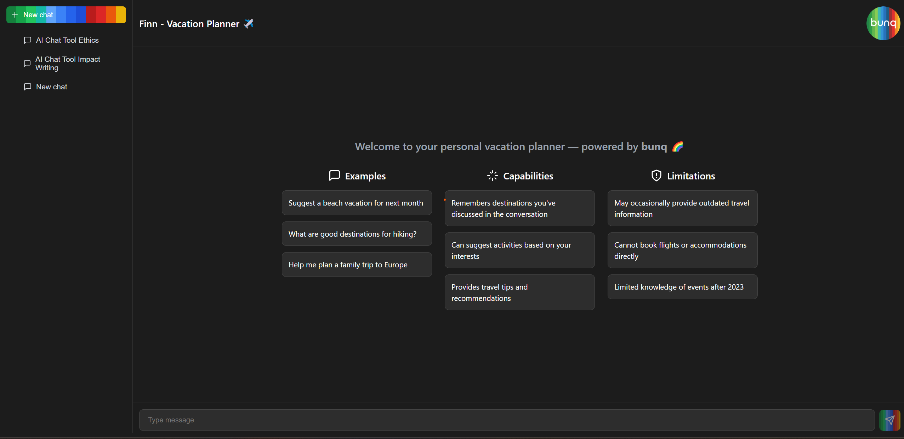
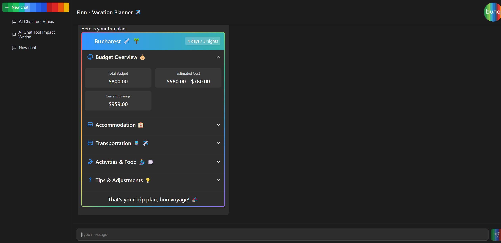
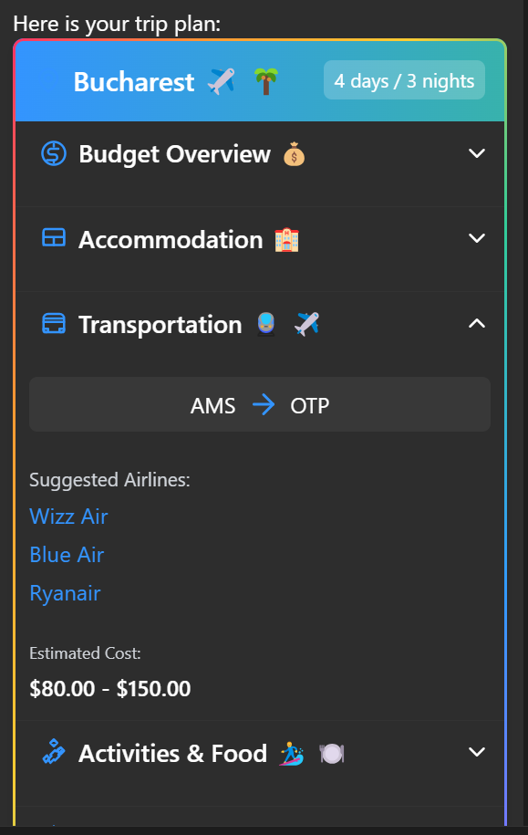
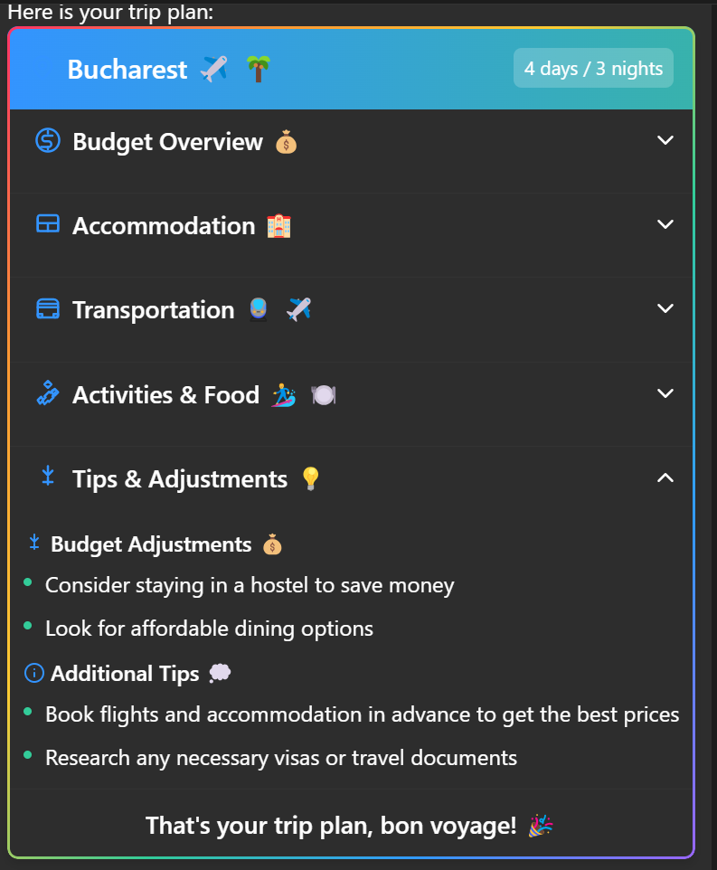
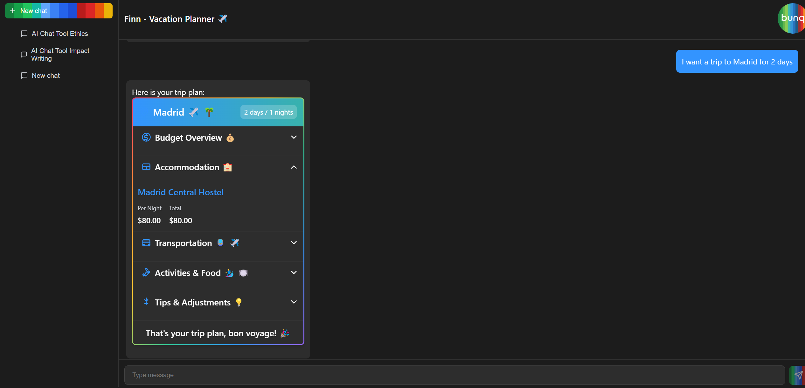

# Finn – Vacation Planner ✈️
**bunq Hackathon 6.0 Submission**

---

## ✨ The Idea

Aren’t you tired of endlessly browsing the internet trying to find your next holiday destination—only to get overwhelmed by financial constraints, too many choices, or a lack of personalization?

**Finn - Vacation Planner** is here to fix that. It's your smart travel companion that **recommends tailor-made vacation plans** based on your:
- **Spending habits** (via bunq transaction history)
- **Budget**
- **Personal preferences**
- **Current mood**


**Finn - Vacation Planner** analyzes your financial data, understands your travel desires through natural conversation, and offers travel suggestions that match your lifestyle. And it works seamlessly on both **desktop and mobile**.

---

## 🧠 Tech Stack

### 🌐 Frontend
- **Angular** (TypeScript)
- **SCSS** (modular CSS)

### 🛠️ Backend
- **FastAPI** (Python)
- **bunq Python SDK** (Sandbox mode)
- **OpenAI Integration** using `meta/llama-3.3-70b-instruct` via NVIDIA’s API

---

## ⚙️ Setup Instructions

### 1. Install frontend dependencies

Make sure you’re in the frontend directory (`vacation-planner/`), then run:

```bash
npm install
```

### 2. Install backend dependencies

In the root folder, run:

```bash
pip install -r requirements.txt
```

### 3. Start the frontend server
```bash
npm start
```

### 4. Start the backend server
```bash
uvicorn api_routing:app --reload
```

### ✅ Now you're good to go!

## 💬 How to Use

When you open the app, you’ll be welcomed by a few example prompts and a friendly input box inviting you to start chatting with **Finn - Vacation Planner**, bunq’s intelligent vacation planner.


On the left side, you’ll find your **chat history**, so you can revisit past travel ideas or continue planning an earlier trip.


Once you share your initial thoughts—like ***“I want a warm place by the beach with my family”***— **Finn - Vacation Planner** quickly analyzes your budget and preferences, and gives you a curated travel plan.


Maybe you’re in the mood for a quick city break in Bucharest — just let **Finn - Vacation Planner** know, and watch it suggest the best options for flights, stays, and things to do.








Want to refine your experience further? No problem! You can continue chatting with **Finn - Vacation Planner** to:

- Change the trip duration
- Add details (like preferred activities or accommodations)
- Specify travel companions, and more!

## 🚀 Future Improvements

- 🪪 Bunq Account Login: Enable users to register with their Bunq account or use **Finn - Vacation Planner** directly in the Bunq app.

- ✈️ Flight & Hotel Booking: Search and book the best travel deals, with priority for Bunq partners.

- 🧠 Activity Suggestions: Integrate with Bunq's AI-based recommendation tool for local activities and experiences.

- 📅 Smart Calendar Sync: Add planned trips directly to your calendar and receive reminders or travel updates.

- 🌍 Multilingual Support: Make **Finn - Vacation Planner** accessible in multiple languages for wider adoption.

## 🏁 Built with ❤️ during Bunq Hackathon 6.0

### We hope you enjoy using **Finn - Vacation Planner** as much as we enjoyed building it. 

### Let the AI take care of the planning—you just pack your bags 💼.
